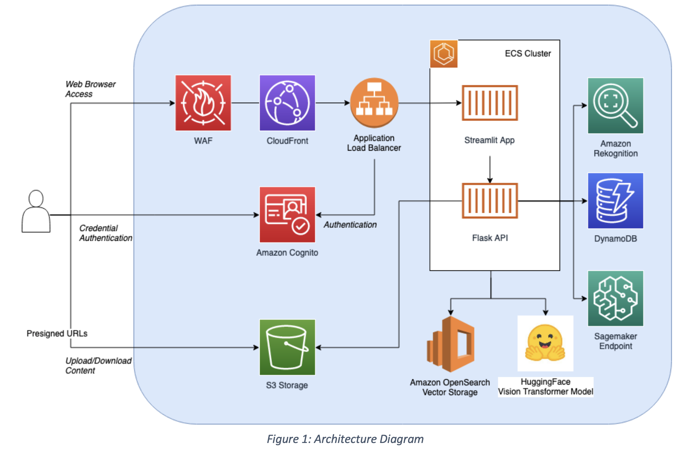

# Insurance Claim - Image Fraud Detection Solution

## Overview

Insurance fraud losses in the US are estimated at $10bn per annum and growing. This results in significant losses for insurers and impacts end customers through increased premiums. This solution was developed after feedback from insurance customers on the challenges they face in detecting fraudulent insurance claims.  Claims for general insurance products such as motor / home contents have accompanying images provided by the end customer which can be analysed to predict the likelihood the claim is fraudulent. This solution can also be applied to other industries where there is a need to analyse an image and determine its authenticity. 

For a given image this solution will: 
1. Determine if the image was taken from the internet (reverse image search)
2. Perform an image similarity check against previously submitted images (image embeddings search) 
3. Image EXIF metadata analysis (Location, distance and date/time of image compared to claim metadata)
4. Object detection (identify objects in image compared to claim metadata)
5. AI generated image detection (image classification model)
6. Calculate an overall normalised fraud score for the image based on results from above

## Architecture

 The solution deploys both a web user interface using [Streamlit](https://streamlit.io/) and backing REST APIs.



## Pre-Requisites

Please ensure you have the following pre-requisites installed:

- [Node.js 18+](https://nodejs.org/en)
- [Yarn Package Manager](https://classic.yarnpkg.com/lang/en/docs/install/#mac-stable)
- [Docker](https://www.docker.com/products/docker-desktop/)
- [Python 3.10+](https://www.python.org/downloads/)
- [AWS CLI](https://aws.amazon.com/cli/)
- [AWS CDK](https://docs.aws.amazon.com/cdk/v2/guide/getting_started.html)

This sample uses the Amazon Bedrock Claude Sonnet 3.5 LLM in the us-west-2 region. Please ensure you have this model enabled; otherwise modify `packages/@aws-prototyping/fraud-detection/app/claim_deduction.py` to run the appropriate LLM in your specified region.


## Running in Development Mode

To run the application in development mode, you will first need to install the pre-requisites. It is recommended to use a [virtual environment](https://www.freecodecamp.org/news/how-to-setup-virtual-environments-in-python/) or [Conda](https://conda.io/projects/conda/en/latest/user-guide/index.html) for this. Pre-requisites can be installed by running `pip install -r requirements.txt `

The Streamlit application can be started by running `streamlit run app.py`

# Building the Prototype


## Steps to Deploy to AWS Account

1. Make sure your AWS credentials have been setup.

2. Navigate to the base of the project using a terminal window and type
   ``yarn``. This will download packages required.

4. [Bootstrap your AWS account](https://docs.aws.amazon.com/cdk/v2/guide/bootstrapping.html) using CDK, if you have
   never used CDK on the account before.
5. Navigate to ``packages/@aws-prototyping/fraud-detection/infra`` and
   enter ```npx cdk synth && npx cdk deploy --require-approval never --all```. This will synthesize the CDK code into
   CloudFormation and deploy it into your AWS account.
6. Go to your Amazon Cognito console and add users as needed.
7. Train the Sagemaker model that will be used to detect AI generated images. To do this, navigate to `packages/@aws-prototyping/fraud-detection/app/detect_ai_generated/train-model.ipynb` and step through the Jupyter notebook to train and deploy the model. While you can run this on your local machine, it is recommended to run it in Amazon Sagemaker using a x86 notebook instance.
8. Next, add the vector indexes for your Opensearch serverless collections. While the Opensearch collections were created using CDK, the vector indexes are still created manually at this time.

- Step 1 

In the AWS Management Console, navigate to Opensearch Serverless and under the collection "fd-col", click on "Create vector index".

- Step 2 

Use `img-vector` for the vector index name, and add a new vector field.

- Step 3 

Follow the above settings to create the vector field.

- Step 4. Save and the vector index should be available for use.

9.  In Amazon Cloudfront, a new distribution is created via CDK for the application. Use the domain name of the Amazon Cloudfront distribution to access the application in a web browser.

10. The solution requires the use of a third party image search API called SerpApi. To use SerpApi, an API key needs to be obtained from the [SerpApi website](https://serpapi.com). The SerpApi API key is stored in an [AWS Secrets Manager secret](https://boto3.amazonaws.com/v1/documentation/api/latest/reference/services/secretsmanager.html). Once you have deployed the CDK stack for the first time, the `SERPApiKeySecretArn` output will contain the ARN to the secret. [Update the secret](https://docs.aws.amazon.com/secretsmanager/latest/userguide/manage_update-secret-value.html) with the SerpApi access key. 

## License

1. Definitions
   “Licensor” means any person or entity that distributes its Work.

“Software” means the original work of authorship made available under this License.

“Work” means the Software and any additions to or derivative works of the Software that are made available under this
License.

The terms “reproduce,” “reproduction,” “derivative works,” and “distribution” have the meaning as provided under U.S.
copyright law; provided, however, that for the purposes of this License, derivative works shall not include works that
remain separable from, or merely link (or bind by name) to the interfaces of, the Work.

Works, including the Software, are “made available” under this License by including in or with the Work either (a) a
copyright notice referencing the applicability of this License to the Work, or (b) a copy of this License.

2. License Grants
   2.1 Copyright Grant. Subject to the terms and conditions of this License, each Licensor grants to you a perpetual,
   worldwide, non-exclusive, royalty-free, copyright license to reproduce, prepare derivative works of, publicly
   display, publicly perform, sublicense and distribute its Work and any resulting derivative works in any form.
   2.2 Patent Grant. Subject to the terms and conditions of this License, each Licensor grants to you a perpetual,
   worldwide, non-exclusive, royalty-free patent license to make, have made, use, sell, offer for sale, import, and
   otherwise transfer its Work, in whole or in part. The foregoing license applies only to the patent claims licensable
   by Licensor that would be infringed by Licensor’s Work (or portion thereof) individually and excluding any
   combinations with any other materials or technology.
3. Limitations
   3.1 Redistribution. You may reproduce or distribute the Work only if (a) you do so under this License, (b) you
   include a complete copy of this License with your distribution, and (c) you retain without modification any
   copyright, patent, trademark, or attribution notices that are present in the Work.
   3.2 Derivative Works. You may specify that additional or different terms apply to the use, reproduction, and
   distribution of your derivative works of the Work (“Your Terms”) only if (a) Your Terms provide that the use
   limitation in Section 3.3 applies to your derivative works, and (b) you identify the specific derivative works that
   are subject to Your Terms. Notwithstanding Your Terms, this License (including the redistribution requirements in
   Section 3.1) will continue to apply to the Work itself.
   3.3 Use Limitation. The Work and any derivative works thereof only may be used or intended for use with the web
   services, computing platforms or applications provided by Amazon.com, Inc. or its affiliates, including Amazon Web
   Services, Inc.
   3.4 Patent Claims. If you bring or threaten to bring a patent claim against any Licensor (including any claim,
   cross-claim or counterclaim in a lawsuit) to enforce any patents that you allege are infringed by any Work, then your
   rights under this License from such Licensor (including the grants in Sections 2.1 and 2.2) will terminate
   immediately.
   3.5 Trademarks. This License does not grant any rights to use any Licensor’s or its affiliates’ names, logos, or
   trademarks, except as necessary to reproduce the notices described in this License.
   3.6 Termination. If you violate any term of this License, then your rights under this License (including the grants
   in Sections 2.1 and 2.2) will terminate immediately.
4. Disclaimer of Warranty.
   THE WORK IS PROVIDED “AS IS” WITHOUT WARRANTIES OR CONDITIONS OF ANY KIND, EITHER EXPRESS OR IMPLIED, INCLUDING
   WARRANTIES OR CONDITIONS OF M ERCHANTABILITY, FITNESS FOR A PARTICULAR PURPOSE, TITLE OR NON-INFRINGEMENT. YOU BEAR
   THE RISK OF UNDERTAKING ANY ACTIVITIES UNDER THIS LICENSE. SOME STATES’ CONSUMER LAWS DO NOT ALLOW EXCLUSION OF AN
   IMPLIED WARRANTY, SO THIS DISCLAIMER MAY NOT APPLY TO YOU.
5. Limitation of Liability.
   EXCEPT AS PROHIBITED BY APPLICABLE LAW, IN NO EVENT AND UNDER NO LEGAL THEORY, WHETHER IN TORT (INCLUDING NEGLIGENCE)
   , CONTRACT, OR OTHERWISE SHALL ANY LICENSOR BE LIABLE TO YOU FOR DAMAGES, INCLUDING ANY DIRECT, INDIRECT, SPECIAL,
   INCIDENTAL, OR CONSEQUENTIAL DAMAGES ARISING OUT OF OR RELATED TO THIS LICENSE, THE USE OR INABILITY TO USE THE
   WORK (INCLUDING BUT NOT LIMITED TO LOSS OF GOODWILL, BUSINESS INTERRUPTION, LOST PROFITS OR DATA, COMPUTER FAILURE OR
   MALFUNCTION, OR ANY OTHER COMM ERCIAL DAMAGES OR LOSSES), EVEN IF THE LICENSOR HAS BEEN ADVISED OF THE POSSIBILITY OF
   SUCH DAMAGES.
   Effective Date – April 18, 2008 © 2008 Amazon.com, Inc. or its affiliates. All rights reserved.
